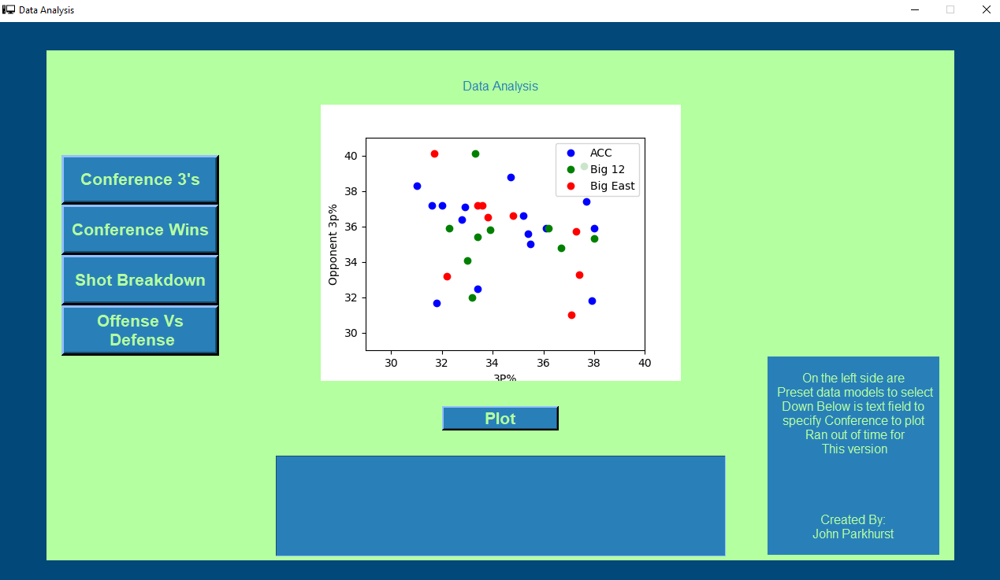
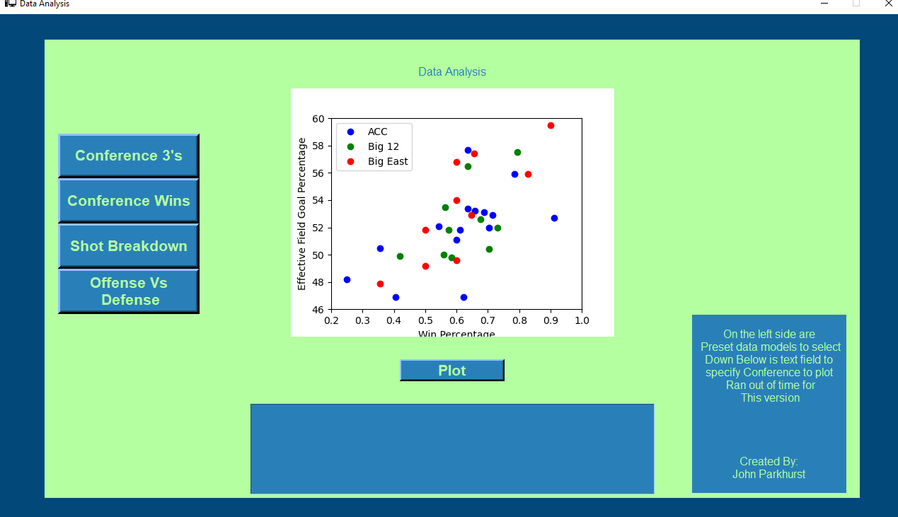

# BasketballStats
A analysis of the 2018 college basketball season. With some data visualization models using matplotlib as well as some basic machine learning models like KNN(k-nearest neighbors algorithm).

# GUI built with TKinter
 
 
 
 
 
